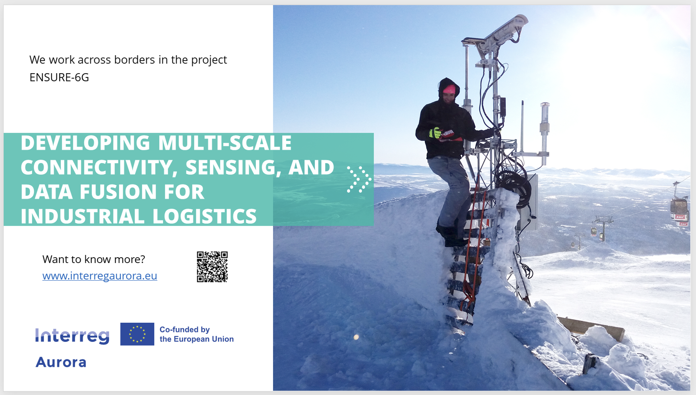
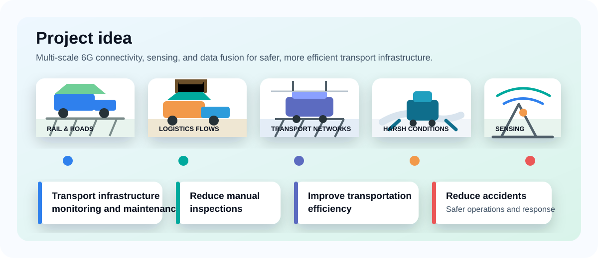
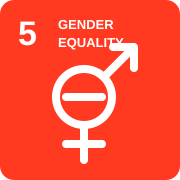
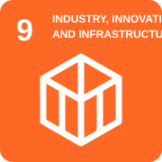
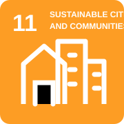
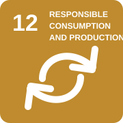
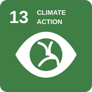
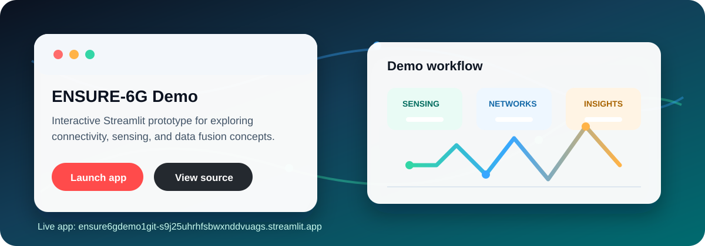

  

<h1 align="center">ENSURE-6G</h1>

  <strong>Trustworthy and resilient 6G systems for industrial logistics</strong>

  
  
  

---

This repository powers the ENSURE-6G GitHub organization profile.

ENSURE-6G develops secure, reliable, and trustworthy next-generation communication systems for industrial and society-critical environments. The project explores how multi-scale connectivity, sensing, and data fusion can improve the dependability and adaptability of future wireless networks.

## Project idea

  

ENSURE-6G applies connectivity, sensing, and data fusion to transport infrastructure use cases such as roads, railways, logistics flows, and harsh operating environments.

## Profile content

The organization profile is maintained in [profile/README.md](profile/README.md).

## Project focus

| Project direction | What it enables |
| --- | --- |
| **Resilient 6G communication** | Robust wireless systems for demanding industrial settings |
| **Secure distributed infrastructure** | Trustworthy connectivity across organizations and borders |
| **Data-driven intelligence** | Monitoring, anomaly detection, and adaptive network behavior |
| **Industrial logistics** | Reliable sensing, coordination, and operational awareness |

## Impact & sustainability

  
  
  
  
  
  
  
  

| Impact area | Related goals |
| --- | --- |
| **Resilient infrastructure** | SDG 9, SDG 11 |
| **Sustainable operations** | SDG 12, SDG 13 |
| **Human and regional value** | SDG 3, SDG 4, SDG 5 |
| **Environmental awareness** | SDG 13, SDG 15 |

## Project page

[Visit the ENSURE-6G project page](https://www.miun.se/en/Research/research-projects/ongoing-research-projects/ENSURE6G/)

## Live demo

  

  
  

| Try it | What you can explore |
| --- | --- |
| **Live Streamlit application** | Interactive ENSURE-6G demo experience for connectivity, sensing, and data fusion concepts. |
| **Open-source demo repository** | Implementation details, app code, and materials in [ENSURE-6G/Ensure6gDemo1](https://github.com/ENSURE-6G/Ensure6gDemo1). |
